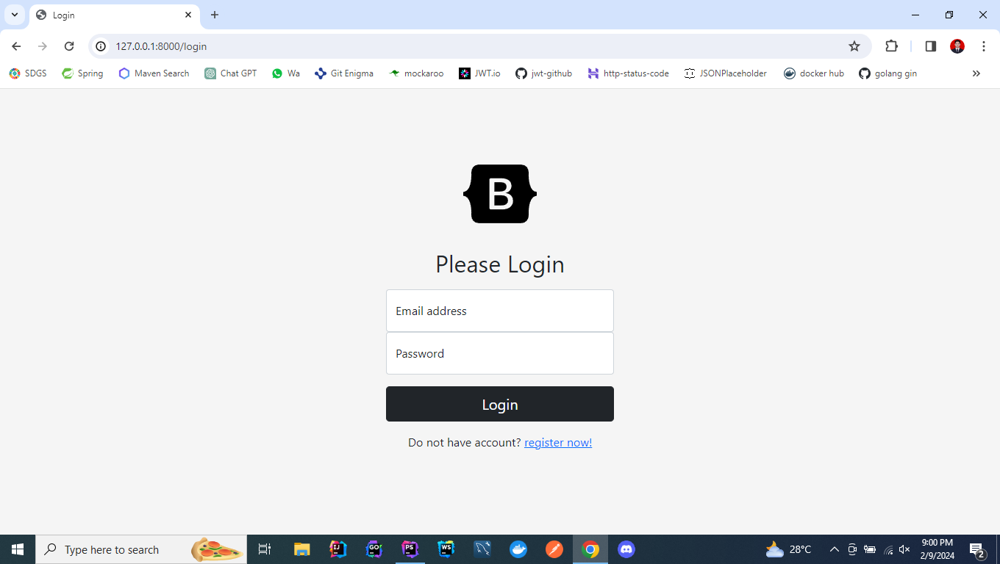
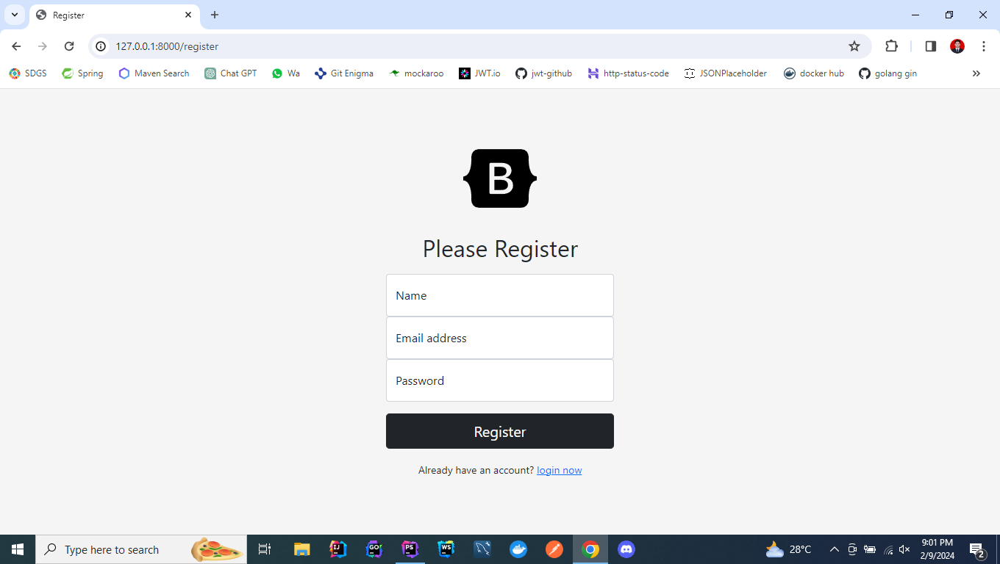
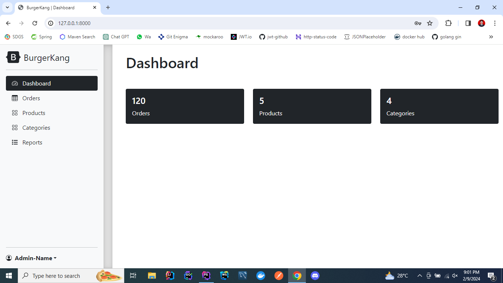
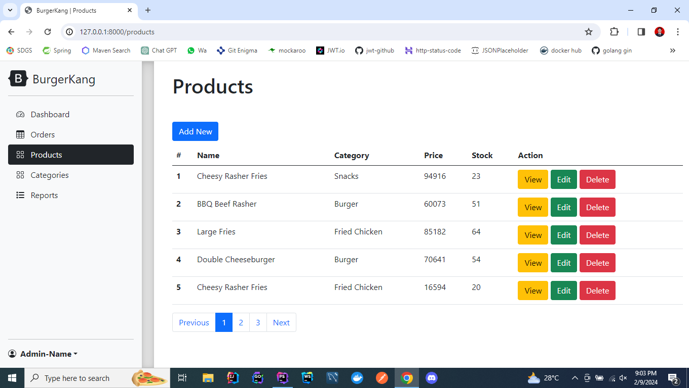
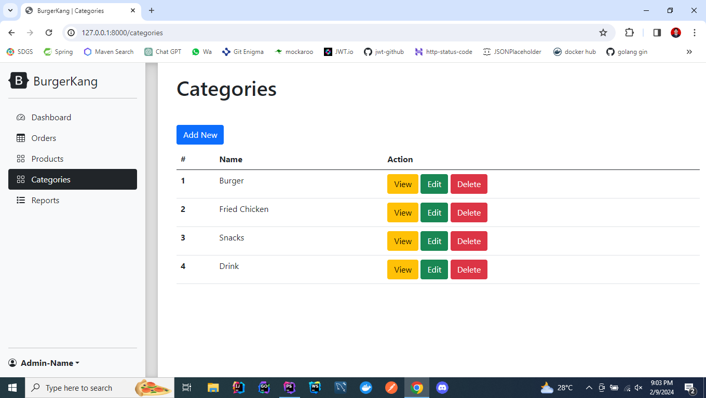

## About BurgerKang

BurgerKang adalah aplikasi kasir yang dibuat menggunakan Laravel 10, php dan bootstrap.
Terdapat featur :
- Login
- Register
- Product [CRUD]
- Category [CRUD]
- Order [CRUD]
- Report [CRUD]

## ERD
- table user
```
id*
name
email
password
```
- table product
```
id*
name
price
stock
category_id (reference : category)
```
- table category
```
id*
name
```
- table order
```
id*
customer_name
created_at
```
- table order_detail
```
id*
order_id (reference : order)
product_id (reference : product)
quantity
price
```
## END POINT
authentication 

- Register http request :

```
get: /register
post: /register
```

- Login http request :

```
get    /login
post   /login
```

- Logout http request :

```
get /logout
```

- Dashboard http request :

```
#auth (login)

get    /
get    /dashboard


```

- Product http request :

```
#auth (login)

get         /products
get         /products/create
get         /products/{id}
post        /products
put         /products/{id}
delete      /products/{id}

```


- Category http request :

```
#auth (login)

get         /categories
get         /categories/create
get         /categories/{id}
post        /categories
put         /categories/{id}
delete      /categories/{id}
```

- Order
Http request :

```
#auth (login)

get     /orders
get     /orders/create
get     /corders/{id}
post    /orders
```

## INTERFACE
- login

- register

- dashboard

- product

- category


